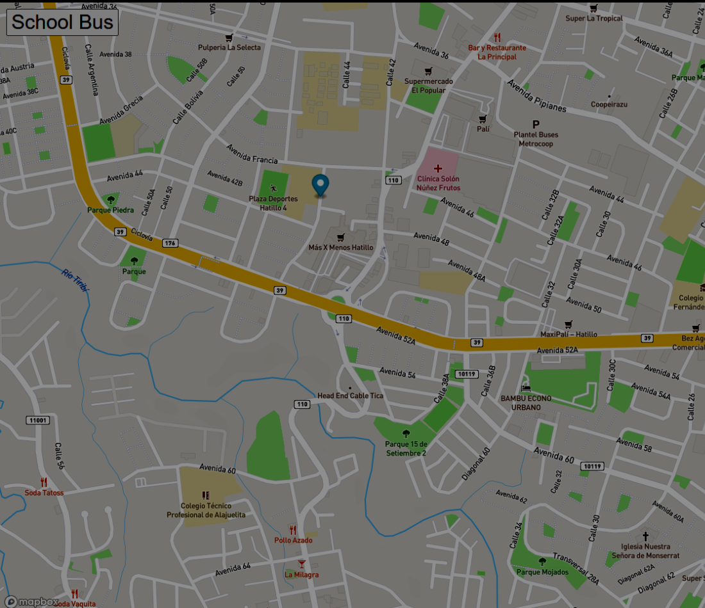

<div align="center" id="top"> 
  

&#xa0;

<a href="https://rayloria.github.io/real-time-bus-tracker-MIT/">Demo</a>

</div>

<h1 align="center">MIT</h1>

<p align="center">
  

  

  

  

  <!--  -->

  <!--  -->

  <!--  -->
</p>

<!-- Status -->

<!-- <h4 align="center">
	🚧  MIT 🚀 Under construction...  🚧
</h4>

<hr> -->

<p align="center">
  <a href="#dart-about">About</a> &#xa0; | &#xa0; 
  <a href="#sparkles-features">Features</a> &#xa0; | &#xa0;
  <a href="#rocket-technologies">Technologies</a> &#xa0; | &#xa0;
  <a href="#white_check_mark-requirements">Requirements</a> &#xa0; | &#xa0;
  <a href="#checkered_flag-starting">Starting</a> &#xa0; | &#xa0;
  <a href="#memo-license">License</a> &#xa0; | &#xa0;
  <a href="https://github.com/RayLoria" target="_blank">Ray Loria</a>
</p>

<br>

## :dart: About

This project was made with mapbox for run this project you need to go to the next link https://www.mapbox.com/ create a account and following the instruccion of the mapbox for genered mapbox key

## :sparkles: Features

:heavy_check_mark: A marker is generated that records a school bus trajectory;\
:heavy_check_mark:A marker move with de stop bus ;\
:heavy_check_mark: Scroll the view of the map for zoom;

## :rocket: Technologies

The following tools were used in this project:

- [HTML](https://www.w3schools.com/html/)
- [CSS](https://www.w3schools.com/css/)
- [JAVASCRIPT](https://www.w3schools.com/js/)

## :white_check_mark: Requirements

Before starting :checkered_flag:, you need to have [Git](https://git-scm.com) and [Visual Studio](https://code.visualstudio.com/) installed.

## :checkered_flag: Starting

```bash
# Clone this project
$ git clone https://github.com/RayLoria/real-time-bus-tracker-MIT

# Access
$ cd BUS TRACKER

# Install dependencies
$ None requirement

# Run the project
$ Open the project with live server

# The server will initialize in the <http://localhost:3000>
```

## :memo: License

This project is under license from MIT. For more details, see the [LICENSE](LICENSE.md) file.

Made with :heart: by <a href="https://github.com/RayLoria" target="_blank">Ray Loria</a>

&#xa0;

<a href="#top">Back to top</a>
